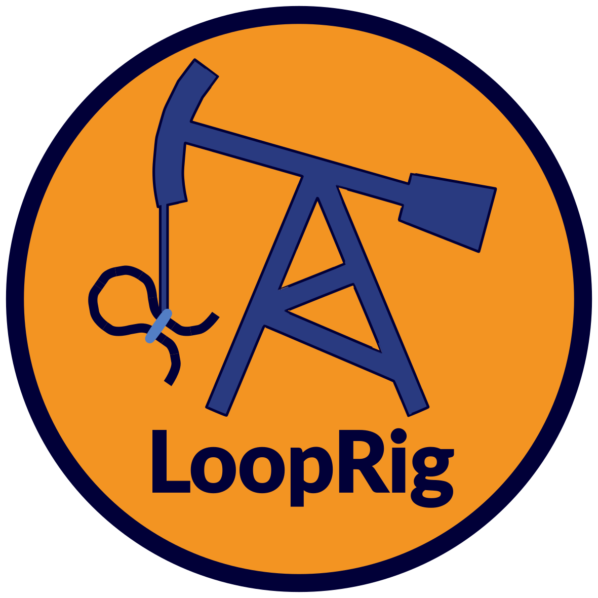

<!-- README.md is generated from README.Rmd. Please edit that file -->
LoopRig 
==============================================================================

[](https://travis-ci.com/hsmaan/LoopRig) [](https://ci.appveyor.com/project/hsmaan/LoopRig) [](https://codecov.io/gh/hsmaan/LoopRig)

Overview
--------

LoopRig is an R package that aims to standardize complex coordinate-based workflows utilizing chromatin loop and genomic element data.

Installation
------------

LoopRig can be installed directly from GitHub:

``` r
# install.packages("devtools")
devtools::install_github("hsmaan/LoopRig")
```

Usage
-----

### Creating S3 Element and Loop Objects

LoopRig has two central S3 classes of objects - *LoopRanges* objects for storing loop data, and *ElementRanges* objects for storing element data. Each class comprises of lists of S4 *GRanges* objects from the GenomicRanges package. Multiple element and looping data can be stored into both object types using the `LoopstoRanges()` and `ElementsToRanges()` functions:

``` r
library(LoopRig)

# Load example files for chromatin loop data
ovary_loops <- system.file("extdata/loops", "ovary_hg19.bedpe", package = "LoopRig", 
    mustWork = TRUE)
pancreas_loops <- system.file("extdata/loops", "pancreas_hg19.bedpe", package = "LoopRig", 
    mustWork = TRUE)
spleen_loops <- system.file("extdata/loops", "spleen_hg19.bedpe", package = "LoopRig", 
    mustWork = TRUE)

# Call LoopsToRanges() on all files at once
loop_ranges <- LoopsToRanges(ovary_loops, pancreas_loops, spleen_loops, custom_cols = 0, 
    loop_names = c("ovary", "pancreas", "spleen"))

# View LoopRanges object for first loop dataset (ovary)
head(loop_ranges, 1)
#> $ovary
#> GRangesList object of length 2:
#> $Anchor 1 
#> GRanges object with 5648 ranges and 0 metadata columns:
#>          seqnames              ranges strand
#>             <Rle>           <IRanges>  <Rle>
#>      [1]     chr5   14140109-14150109      *
#>      [2]     chr5   29850107-29860107      *
#>      [3]     chr5 158137008-158147008      *
#>      [4]     chr5 158197008-158207008      *
#>      [5]     chr5 158167008-158177008      *
#>      ...      ...                 ...    ...
#>   [5644]     chr4   78621154-78631154      *
#>   [5645]     chr4   33601622-33611622      *
#>   [5646]     chr4   41452017-41462017      *
#>   [5647]     chr4   99321151-99331151      *
#>   [5648]     chr4 169501151-169511151      *
#> 
#> ...
#> <1 more element>
#> -------
#> seqinfo: 23 sequences from an unspecified genome; no seqlengths

# Check LoopRanges class
class(loop_ranges)
#> [1] "LoopRanges"
```

Each chromatin loop data set is stored as a *GRangesList* object within the *LoopRanges* object. Similarly for elements using `ElementsToRanges()`:

``` r
# Load example files for genomic element data
enhancers <- system.file("extdata/elements", "enhancers.bed", package = "LoopRig", 
    mustWork = TRUE)
promoters <- system.file("extdata/elements", "promoters.bed", package = "LoopRig", 
    mustWork = TRUE)

# Call ElementsToRanges() on all files at once
element_ranges <- ElementsToRanges(enhancers, promoters, element_names = c("enhancers", 
    "promoters"), custom_cols = 1, custom_mcols = 4)

# View ElementRanges object for first element type (enhancers)
head(element_ranges, 1)
#> $enhancers
#> GRanges object with 1000 ranges and 1 metadata column:
#>          seqnames              ranges strand |       mcols
#>             <Rle>           <IRanges>  <Rle> | <character>
#>      [1]     chr2   48752479-48807772      * |        E573
#>      [2]     chrX     9000916-9002368      * |       E1383
#>      [3]     chr4   84406018-84406908      * |       E6724
#>      [4]    chr15   90773255-90784140      * |       E3155
#>      [5]     chr1 112525348-112535556      * |       E8752
#>      ...      ...                 ...    ... .         ...
#>    [996]    chr12   50781274-50836617      * |       E9077
#>    [997]     chr6 150067458-150068014      * |       E1642
#>    [998]    chr17   34263213-34274392      * |       E6285
#>    [999]     chr3 192954838-192959007      * |       E5603
#>   [1000]     chr1 204432559-204468852      * |        E281
#>   -------
#>   seqinfo: 25 sequences from an unspecified genome; no seqlengths

# Check ElementRanges class
class(element_ranges)
#> [1] "ElementRanges"
```

Similar to *LoopRanges*, *ElementRanges* objects comprise of a list of *GRanges* objects storing genomic element coordinates.

### Determining a Consensus Set of Chromatin Loops

There’s a wealth of publicly available chromatin loop data, and one of the most important challenges is extracting high-confidence interactions. The `ConsensusLoops()` function can be used on objects of *LoopRanges* class:

``` r
# Call the ConsensusLoops() function. Stringency indicates how many datasets a
# loop must be present in to be considered a consensus loop, and the overlap
# threshold (base-pairs) defines a *hit* across datasets.
consensus_loops <- ConsensusLoops(loop_ranges, stringency = 2, overlap_threshold = 10)

# View consensus_loops
head(consensus_loops, 1)
#> $Consensus
#> GRangesList object of length 2:
#> $Anchor 1 
#> GRanges object with 12 ranges and 0 metadata columns:
#>        seqnames              ranges strand
#>           <Rle>           <IRanges>  <Rle>
#>    [1]     chr8 121702240-121712240      *
#>    [2]     chr1     8700059-8710059      *
#>    [3]    chr16   65013903-65023903      *
#>    [4]     chr2 173894728-173904728      *
#>    [5]     chr3 111428847-111438847      *
#>    ...      ...                 ...    ...
#>    [8]     chr1     8700059-8710059      *
#>    [9]    chr16   65013903-65023903      *
#>   [10]    chr13   42234136-42244136      *
#>   [11]     chr2 173894728-173904728      *
#>   [12]     chr3 111428847-111438847      *
#> 
#> ...
#> <1 more element>
#> -------
#> seqinfo: 23 sequences from an unspecified genome; no seqlengths

# Check class
class(consensus_loops)
#> [1] "LoopRanges"
```

The `ConsensusLoops()` function still returns an object of *LoopRanges* class, which can be used in many subsequent functions for analysis.

### Finding Element Linkage Mediated by Chromatin Loops

LoopRig provides three functions for linking elements datasets based on chromatin loops: `LinkedElements()`, `StackedElements()`, and `ScaffoldElements()`. The most commonly used function will be `LinkedElements()`, as it considers which elements from two datasets are linked by chromatin loop anchors:

``` r
# LinkedElements() will only take LoopRanges objects of length 1, as it is built
# for considering the results of a ConsensusLoops() call.

# Two element datasets from ElementRanges objects can be used by indexing each
# one as a list

# Call LinkedElements() for the promoter and enhancer ranges in element_ranges
# and use the default output parameters (dataframe)
linked_elements <- LinkedElements(consensus_loops, element_ranges[[1]], element_ranges[[2]])

# View resulting dataframe indicating linked promoters and enhancers
linked_elements
#> [1] Anchor_1 Anchor_2
#> <0 rows> (or 0-length row.names)
```

Linkage functions can also return *ElementRanges* objects, subset based on the properties of the function. For example, `LinkedElements(..., range_out_x = TRUE)` will return an *ElementRanges* object for the subset of the first set of elements that are linked to the second set through loops. This allows for a continuous and dynamic workflow involving multiple subsetting steps.

License
-------

[GNU General Public License 3.0](https://github.com/hsmaan/LoopRig/blob/master/LICENSE)
